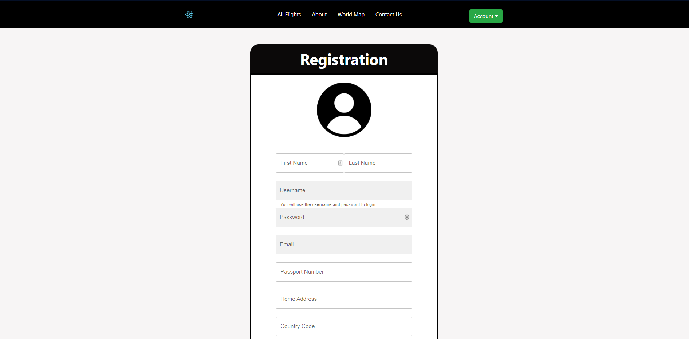
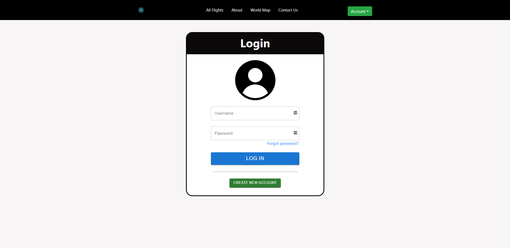
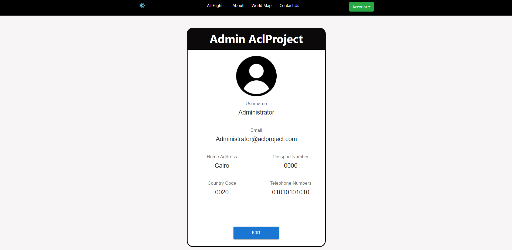
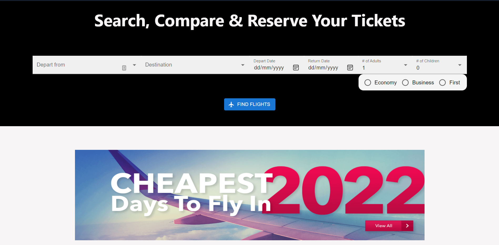
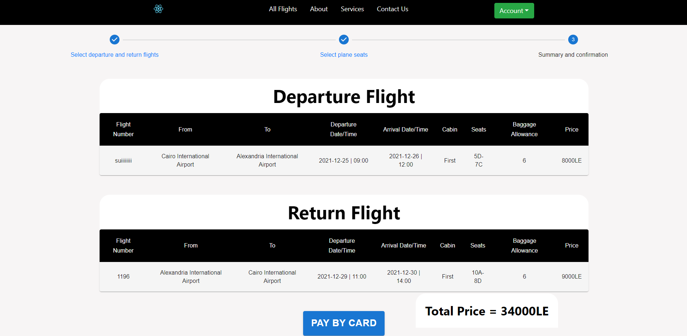

# AclProject
The following Project is a complete implementation of a Flight Booking Website using MERN stack that 
simulate a thorough experience of reserving a flight.

## Table of Contents

- [Description](#Description)
- [Motivation](#motivation)
- [Build Status](#Build-Status)
- [Screenshots](#Screenshots)
- [Install](#Install)
- [Usage](#usage)
- [Tests](#Tests)
- [Contribute](#Contribute)
- [Credits](#Credits)
- [License](#License)

## Description
The website is designed to recreate a flight booking experience where the user can go from selecting a flight they want to
reserve to choosing the seats they want from the available seats that are shown to them to confirming their flight and paying
for them with their debit/credit card.

If the user is logged in as an administator then they have the ability to create/edit/delete any flight they want to.

The user also has the ability to sign up in order to have their data stored in order to book any flight the want if they are
visiting the website as a guest.

The user can also check their reserved flight as well as change any criteria they do not like form changing the seats that they
chose to changing the whole flight from beginning to end, also they can cancel their flight simply and get their money back.

## Motivation
The reason behind this project is creating a full working flightbooking website with every feature 
needed to ensure a satisfying experience for all the users with minimal effort.

## Build Status
The code fully works and does not contain any bugs/errors.

## Screenshots
 
 
 
 
 
 
 
 

## Install
Back-end installation:

```sh
npm install express node mongoose react
```
```sh
npm install nodemailer 
```
```sh
npm install bcryptjs 
```
```sh
npm install body-parser 
```
```sh
npm install jsonwebtoken 
```
```sh
npm install cors
```
```sh
npm install config
```
```sh
npm install nodemon
```

Front-end installation:

```sh
cd client
npm install
```
```sh
npm install axios
```
```sh
npm install react
```
```sh
npm install react-bootstrap
```
```sh
npm install react-confirm-alert
```
```sh
npm install react-confirm-box
```
```sh
npm install react-dom
```
```sh
npm install react-icons
```
```sh
npm install react-responsive-modal
```
```sh
npm install react-router-dom
```
```sh
npm install react-scripts
```
```sh
npm install react-stripe-checkout
```
```sh
npm install styled-components
```
```sh
npm install utils
```
```sh
npm install web-vitals
```
```sh
npm install @emotion/react
```
```sh
npm install @emotion/styled
```
```sh
npm install @mui/icons-material
```
```sh
npm install @mui/material
```
```sh
npm install @mui/x-data-grid
```
```sh
npm install @stripe/react-stripe-js
```
```sh
npm install @stripe/stripe-js
```
```sh
npm install @testing-library/jest-dom
```
```sh
npm install @testing-library/react
```
```sh
npm install @testing-library/user-event
```
## Usage
To be able to run the project the following codes will be run on two terminals:

Terminal 1
```sh
npm run app
```
Terminal 2
```sh
cd client
```
```sh
npm start
```

Also a database connection need to be made before using the website and this can be achieved in the following steps:
 
 1-Create a mongoose atlas account and establish a connection

 2-Enter the following line in app.js file to connect the database using the code in the link below:
 https://www.mongodb.com/blog/post/quick-start-nodejs-mongodb-how-to-get-connected-to-your-database

 3-Change username, password and your-cluster-url to your info. where you will find them in your connection.

## Tests
Every aspect of the project could be tested like for example creating a flight and reserving it, cancelling
a reservation and getting refunded, deleting/editing a flight, changing seats or flights to see the reflection 
of these things on the database.

## Contribute
For anyone who would like to contribute in the development of the project 
just clone the repository using the link that you can find in 'code' button 
or use the following link:

```sh
git clone https://github.com/advanced-computer-lab/AclProject.git
```

## Credits
German University in Cairo
Name | Mohamed Mahmoud | Noureldin Hesham | Youssef Magdy | Ahmed Hussein | Omar Alhadi
--- | --- | --- | --- | --- | ---
ID | 46-14531 | 46-12946 | 46-0929 | 46-0726 | 46-14114

## License

[MIT](License) © ACLTeam

